# Self-Checkout Using Python

## Wonder Mart

Wonder Mart is self-checkouts (SCOs), also known as assisted checkouts (ACOs) or self-service checkouts. It is a minimarket with a self-service cashier that makes it easy for customers to make shopping calculations, add shopping items, and other features that support customer convenience and satisfaction in shopping.

[](https://youtu.be/9LbF91BHmLU)

## Objective

Objectives in the project include:

- To create a program that allocates self-checkout
- To apply some programming concepts in Python
- To apply PEP8 principles for clean code programs
- Easy to improve and easy to use program

The objective requirements of the program include the following:

- Users can add orders to the cart.
- Users can see an overview of orders that have been added to the cart.
- Users can make modifications to orders that have been added.
- Users can see an overview of the payment of the entire order.
- Users can reset the shopping cart automatically, thereby deleting the entire order.

## Tools And Liblary

The tools and libraries used to support this project include:<br>
**Tools :**

[](https://code.visualstudio.com)
[](https://www.python.org/)
[](https://www.python.org/)

**Liblary**

- For coloring terminal console using [`colored 1.4.4`](https://pypi.org/project/colored/)

```bash
pip install colored
```

- The currency format in the nominal transaction using [`babel 2.11.0`](https://babel.pocoo.org/en/latest/api/numbers.html)

```bash
pip install Babel
```

## Installation

> **⚠️** It is recommended to use latest version python or **minimum version 3.10**. If a lower version is used, an error will occur because of the use of syntax that is only found in python `3.10` and above. As of early 2021, [the match keyword](https://stackoverflow.com/questions/65971976/python-structural-pattern-matching#:~:text=As%20of%20early%202021%2C%20the,else%20statements%20or%20a%20dictionary.) does not exist in the released python versions `<= 3.9.`


#### Using Git

```bash
git clone git@github.com:nicodemusnaisau/Wonder-Mart.git
```

```bash
cd Wonder-Mart
```

```bash
python Main.py
```

## Function Definition

| **No** |      **Function**       | **Parameter**                                   |
| :----: | :---------------------: | ----------------------------------------------- |
|   1    |      def create()       | no_item, id_product, date_add, price, item, qty |
|   2    |      def update()       | no_item, id_product, date_add, price, item, qty |
|   3    |      def delete()       | no_item, id_product, date_add, price, item, qty |
|   4    | def create_first_data() | no_item, id_product, date_add, price, item, qty |
|   5    |   def clean_console()   | match os user system                            |
|   6    |  def read(\*\*kwrags)   | index_item                                      |
|   7    |    def total_price()    | price_total, price_each                         |
|   8    |       def reset()       | os.replace                                      |

## Test Case👀

<!-- > **NOTE:** For correct usage documentation, check documentation from tag for corresponding version.
> Example commands: -->

<details>
<summary>👇<b> Add Items</b> </summary>
<hr>

- Add items
  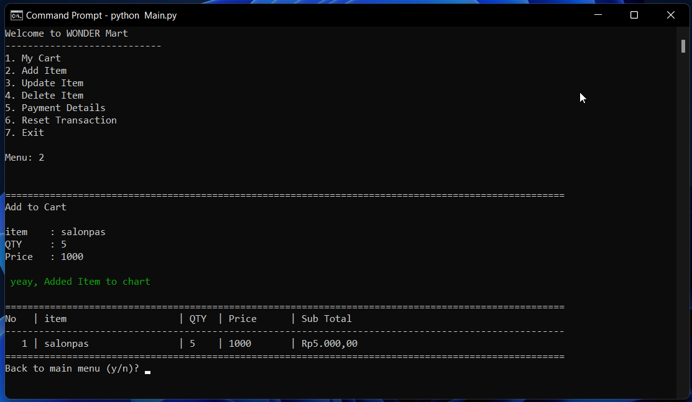
- View Cart
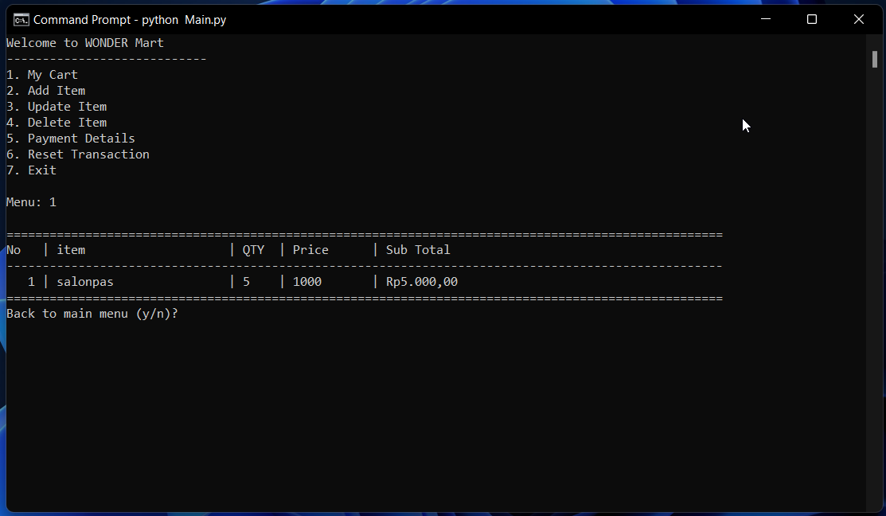
</details>
<details>
<summary>👇<b> Update Items</b> </summary>
<hr>

- Update item name
  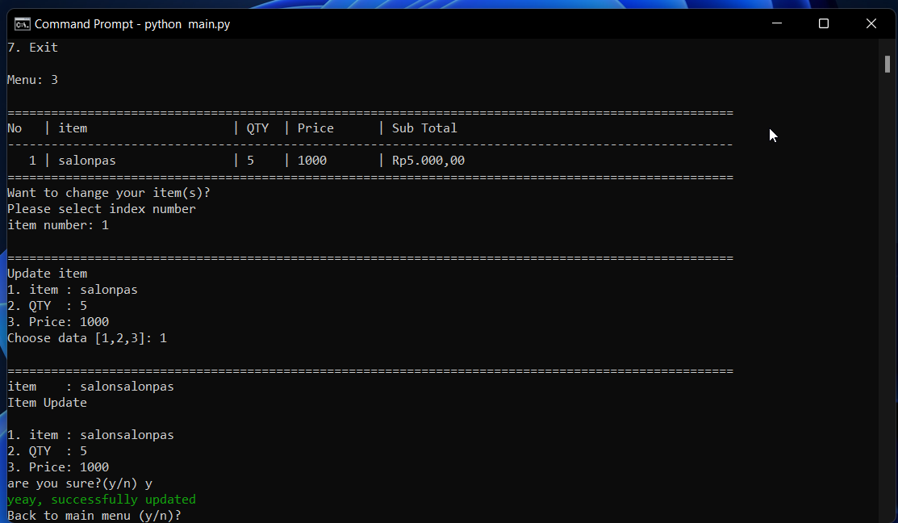
  - Result Update item name
    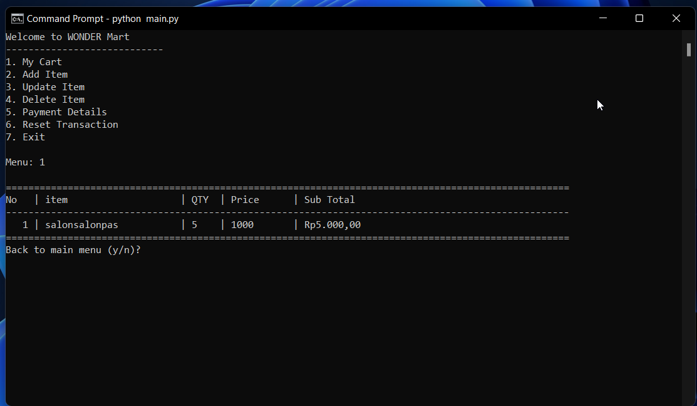
- Update Quantity item
  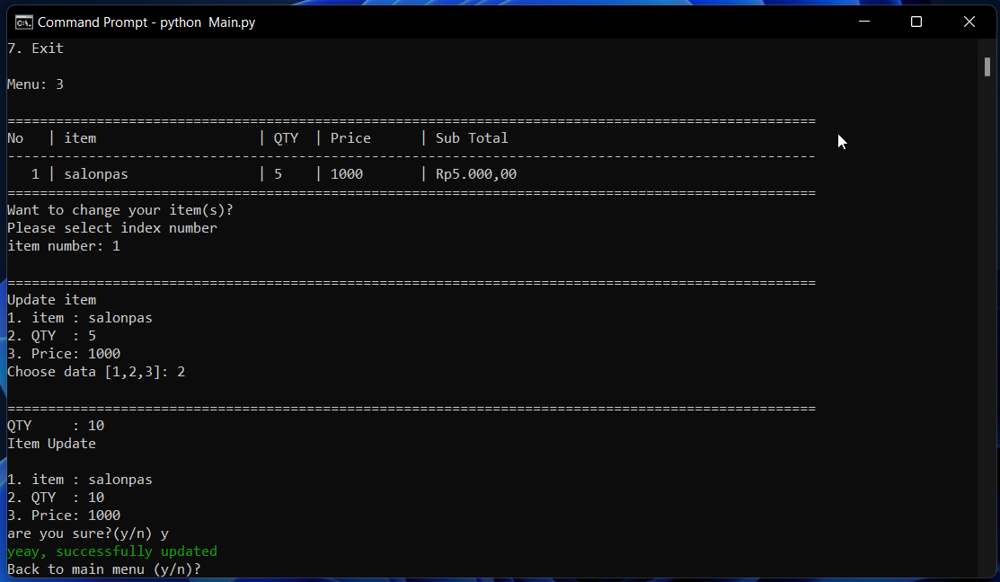
  - Result Update Quantity
    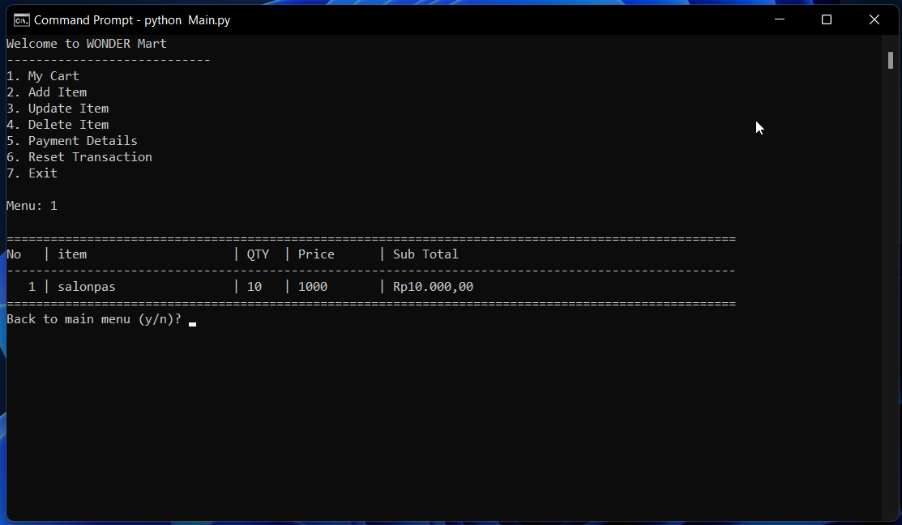
- Update price item
  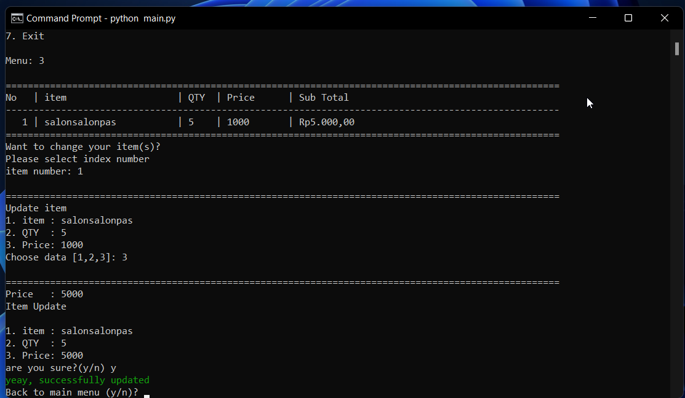
  - Result Update price
    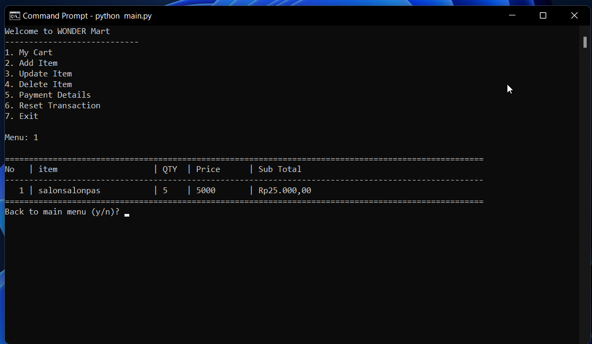
- Update condition when null item

</details>
<details>
<summary>👇<b> Delete Items</b> </summary>
<hr>

- Delete items spesific
  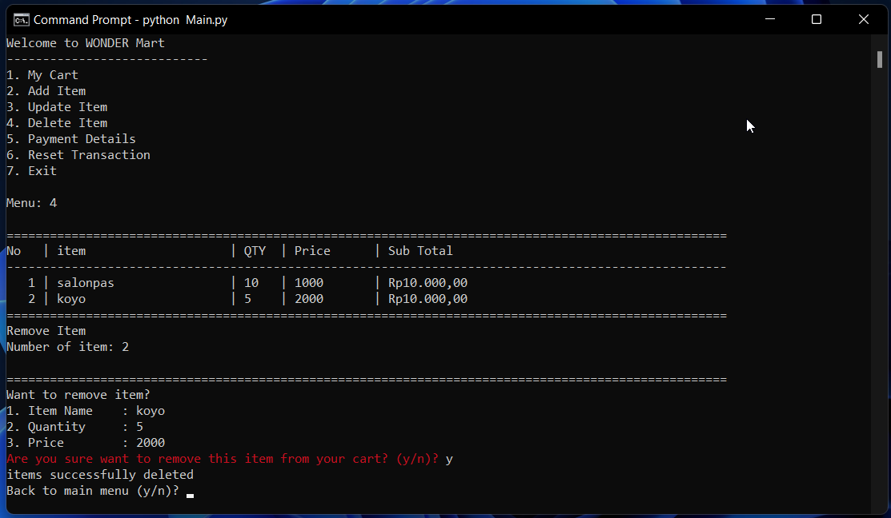
  - Delete items view
    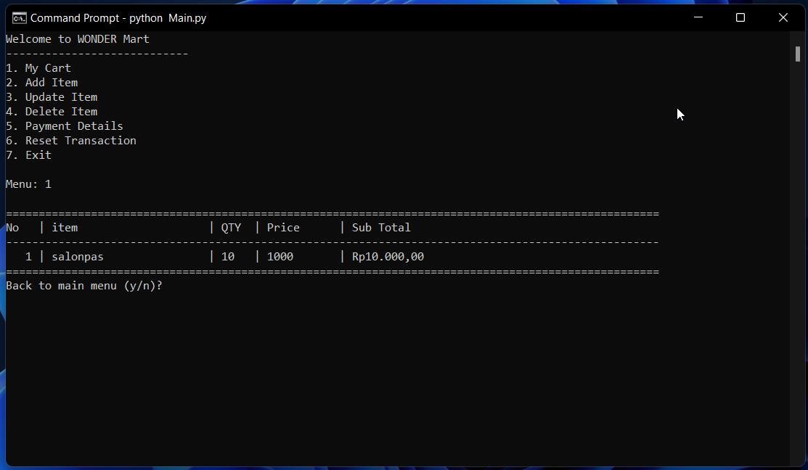
- Delete when null item
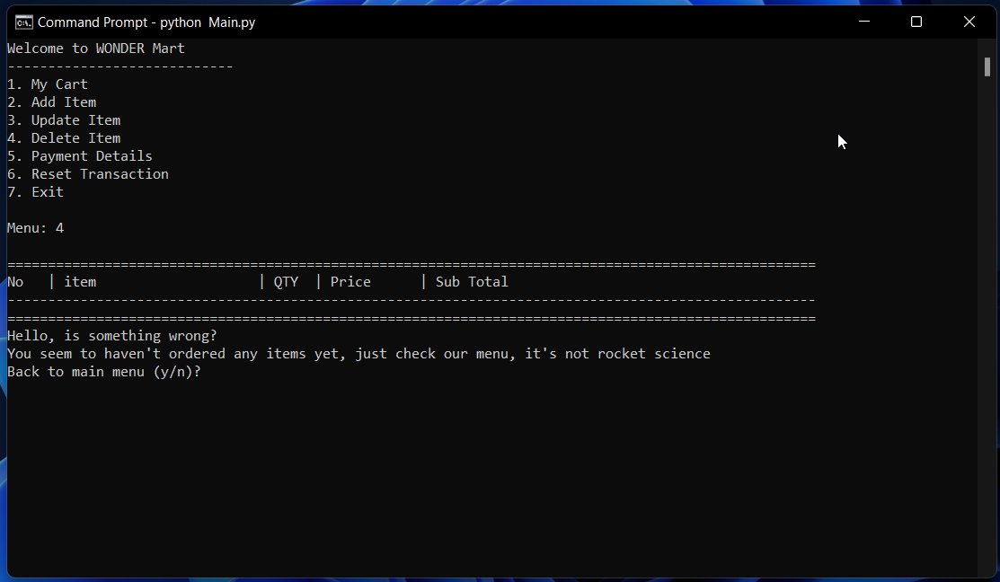
</details>
<details>
<summary>👇<b> Payment Details</b> </summary>
<hr>

- View Payment Summary when null item
  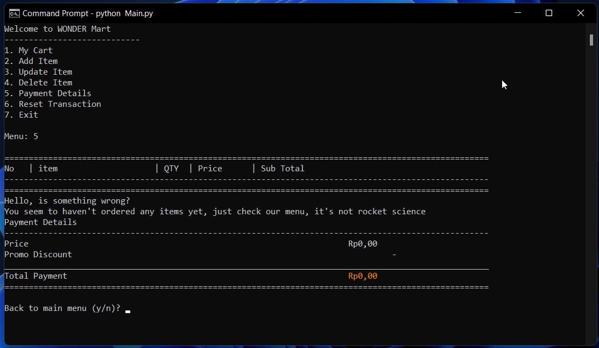
- View Payment Summary
  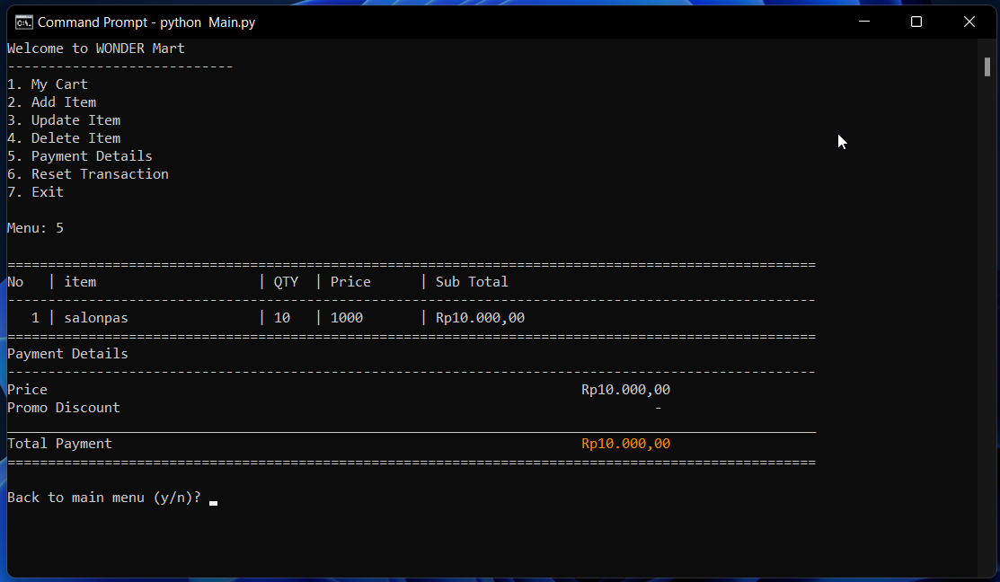
- Discount condition when order more than Rp200.000
  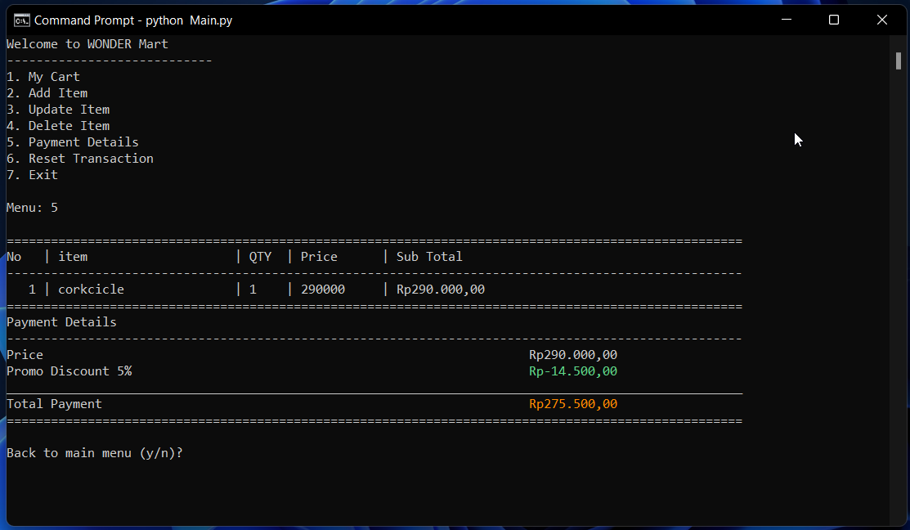
- Discount condition when order more than Rp300.000
  
- Discount condition when order more than Rp500.000
  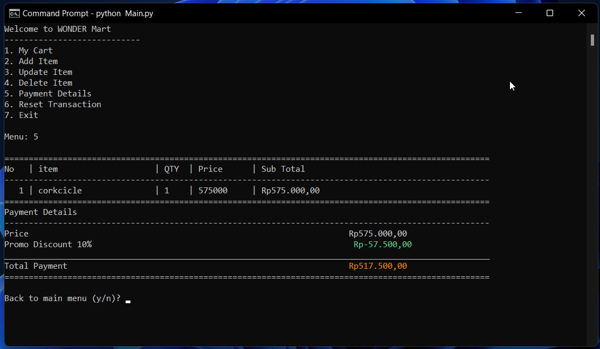

</details>
<details>
<summary>👇<b> Reset Transaction</b> </summary>
<hr>

- Reset Transaction
  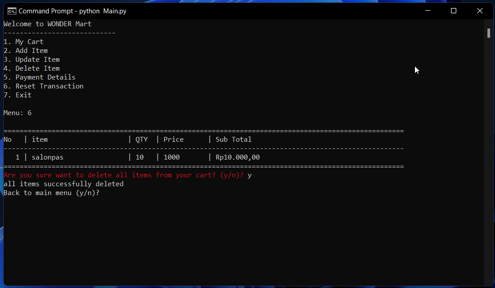
- View Cart
  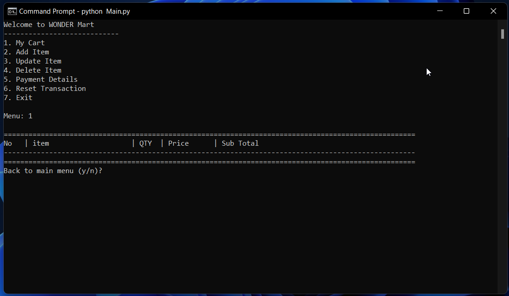

</details>
<details>
<summary>👇<b> Exit</b> </summary>
<hr>

- Exit Program
  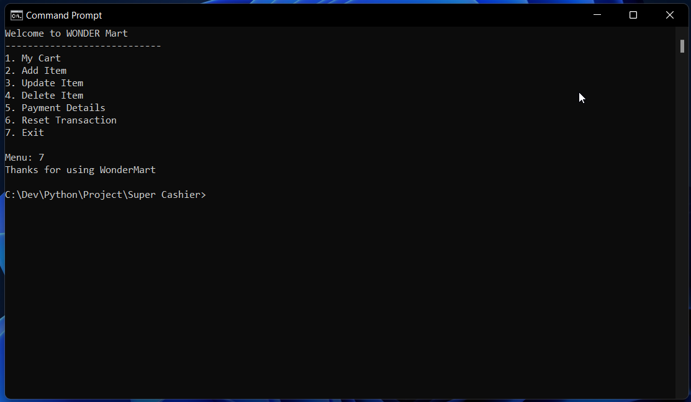

</details>

## Feature Works🚀
- Implementing a GUI for a friendly interface.
- Adding payment features and nominal change.
- Export Data to CSV in every order transaction.
